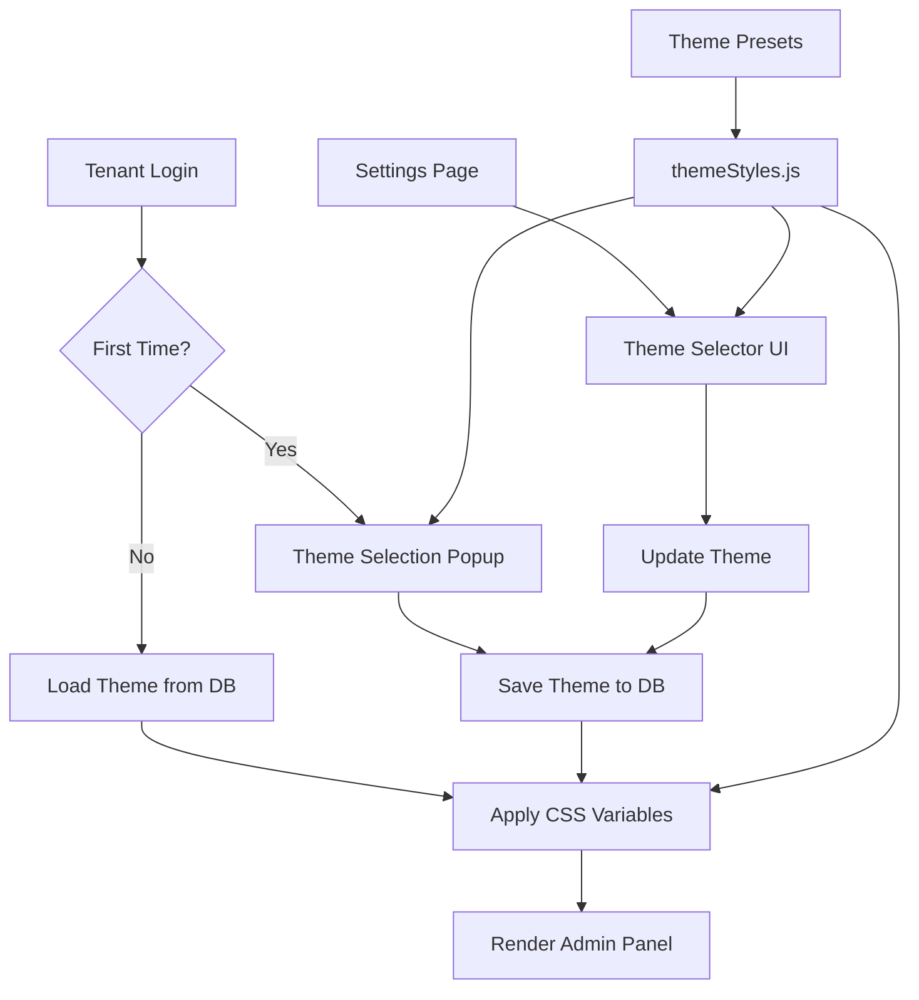

# Design Document: Seamless Branding Integration

## Overview

The Seamless Branding Integration feature enables tenant owners to customize the visual appearance of their Admin Panel by selecting from predefined theme presets. This feature aligns the Admin Panel's visual identity with the Landing Page's white-coffee color scheme while maintaining complete isolation from customer-facing views.

### Goals

- Provide a flexible theme system that allows tenant owners to personalize their admin experience
- Ensure seamless theme persistence across sessions and devices via database storage
- Deliver an intuitive first-time onboarding experience with theme selection
- Maintain strict visual isolation between admin and customer interfaces
- Implement dynamic styling using CSS variables for real-time theme switching

### Non-Goals

- Customer-facing theme customization (reserved for future implementation)
- Complex theme builder with custom color pickers
- Theme preview in customer view
- Multi-theme support per tenant (only one active theme at a time)

### Key Design Decisions

1. **CSS Variables over Inline Styles**: Using CSS custom properties (`--bg-main`, `--bg-sidebar`, etc.) allows for efficient, real-time theme updates without component re-renders
2. **Database-First Persistence**: Theme preferences stored in `superkafe_main.tenants` collection ensures consistency across devices and sessions, avoiding localStorage sync issues
3. **Preset-Based Approach**: Limiting themes to predefined presets (default, light-coffee) ensures visual consistency and reduces complexity
4. **First-Time Popup Pattern**: Implementing a non-intrusive onboarding modal that appears once per tenant improves user experience without being repetitive
5. **Scope Isolation via Directory Structure**: Admin themes apply only to components in `frontend/src/pages/admin/` directory, preventing unintended styling of customer views

## Architecture

### System Context

The theme system operates within the existing SuperKafe multi-tenant architecture:

```
┌─────────────────────────────────────────────────────────────┐
│                    SuperKafe Platform                        │
│                                                              │
│  ┌────────────────┐         ┌──────────────────┐           │
│  │   Frontend     │◄────────┤   Backend API    │           │
│  │   (React)      │         │  (Node/Express)  │           │
│  └────────────────┘         └──────────────────┘           │
│         │                            │                      │
│         │                            │                      │
│    ┌────▼─────┐              ┌──────▼────────┐            │
│    │  Theme   │              │  MongoDB       │            │
│    │  System  │              │  superkafe_v2  │            │
│    └──────────┘              └────────────────┘            │
│                                                              │
└─────────────────────────────────────────────────────────────┘
```

### Theme System Architecture



### Data Flow

1. **Authentication Flow**:
   - User logs in → Backend validates credentials
   - JWT token generated with `tenantId` and `tenantSlug`
   - Backend includes `selectedTheme` in auth response
   - Frontend stores theme preference in React state

2. **Theme Application Flow**:
   - Theme preference loaded from auth response or API call
   - Theme preset retrieved from `themeStyles.js`
   - CSS variables updated on document root element
   - All admin components automatically reflect new theme

3. **Theme Update Flow**:
   - User selects theme in Settings or First-Time Popup
   - Frontend sends PUT request to `/api/tenants/:tenantId/theme`
   - Backend validates theme name and user permissions
   - Database updated with new `selectedTheme` value
   - Frontend applies theme immediately via CSS variable update

### Technology Stack

- **Frontend**: React 18, React Router v6, Framer Motion (animations)
- **Backend**: Node.js, Express.js, Mongoose ODM
- **Database**: MongoDB (superkafe_v2 database)
- **Styling**: CSS Variables, Tailwind CSS (utility classes)
- **State Management**: React Context API, SWR for data fetching

## Components and Interfaces

### Frontend Components

#### 1. ThemeProvider Context

**Location**: `frontend/src/context/ThemeContext.jsx`

**Purpose**: Manages global theme state and provides theme switching functionality

**Interface**:
```javascript
interface ThemeContextValue {
  currentTheme: string;           // 'default' | 'light-coffee'
  themeConfig: ThemeConfig;       // Current theme color values
  setTheme: (themeName: string) => Promise<void>;
  isLoading: boolean;
}

interface ThemeConfig {
  bgMain: string;
  bgSidebar: string;
  accentColor: string;
  textPrimary: string;
}
```

**Responsibilities**:
- Load theme preference from auth response or API
- Apply CSS variables to document root
- Provide theme switching function to child components
- Handle theme update API calls

#### 2. ThemeSelector Component

**Location**: `frontend/src/components/admin/ThemeSelector.jsx`

**Purpose**: UI component for selecting themes in Settings page

**Props**:
```javascript
interface ThemeSelectorProps {
  currentTheme: string;
  onThemeChange: (themeName: string) => void;
  disabled?: boolean;
}
```

**Features**:
- Visual preview cards for each theme preset
- Radio button selection
- Real-time preview of selected theme
- Loading state during theme update

#### 3. FirstTimeThemePopup Component

**Location**: `frontend/src/components/admin/FirstTimeThemePopup.jsx`

**Purpose**: Modal dialog for first-time theme selection

**Props**:
```javascript
interface FirstTimeThemePopupProps {
  isOpen: boolean;
  onThemeSelect: (themeName: string) => void;
  onSkip: () => void;
}
```

**Features**:
- Non-blocking modal overlay
- Visual theme previews with descriptions
- Skip option (defaults to 'default' theme)
- Animated entrance/exit

#### 4. Updated AdminLayout Component

**Location**: `frontend/src/pages/admin/AdminLayout.jsx`

**Modifications**:
- Wrap with `ThemeProvider`
- Check for first-time flag and show popup
- Apply theme-aware CSS classes

#### 5. Updated Pengaturan (Settings) Component

**Location**: `frontend/src/pages/admin/Pengaturan.jsx`

**Modifications**:
- Add "Mode Tampilan" section with `ThemeSelector`
- Handle theme save with success/error feedback
- Show current theme status

### Backend Components

#### 1. Theme Management Routes

**Location**: `backend/routes/themeRoutes.js`

**Endpoints**:
```javascript
// Get current theme for authenticated tenant
GET /api/tenants/:tenantId/theme

// Update theme for authenticated tenant
PUT /api/tenants/:tenantId/theme
```

#### 2. Theme Controller

**Location**: `backend/controllers/ThemeController.js`

**Methods**:
```javascript
// Get tenant's current theme
async getTheme(req, res)

// Update tenant's theme
async updateTheme(req, res)
```

**Validation**:
- Verify user has access to tenant
- Validate theme name against allowed presets
- Return 403 if unauthorized, 400 if invalid theme

#### 3. Updated Tenant Model

**Location**: `backend/models/Tenant.js`

**Schema Additions**:
```javascript
{
  selectedTheme: {
    type: String,
    enum: ['default', 'light-coffee'],
    default: 'default'
  },
  hasSeenThemePopup: {
    type: Boolean,
    default: false
  }
}
```

#### 4. Updated Authentication Controllers

**Location**: `backend/controllers/UnifiedAuthController.js`, `backend/controllers/GlobalAuthController.js`

**Modifications**:
- Include `selectedTheme` and `hasSeenThemePopup` in auth response
- Populate tenant data when generating JWT

### Shared Resources

#### 1. Theme Presets Configuration

**Location**: `frontend/src/config/themeStyles.js`

**Structure**:
```javascript
export const themePresets = {
  default: {
    name: 'Default (Dark Purple)',
    bgMain: '#0F0A1F',
    bgSidebar: '#1E1B4B',
    accentColor: '#8B5CF6',
    textPrimary: '#FFFFFF'
  },
  'light-coffee': {
    name: 'Light Coffee',
    bgMain: '#FFFFFF',
    bgSidebar: '#4E342E',
    accentColor: '#A0522D',
    textPrimary: '#2D2D2D'
  }
};

export const getThemeConfig = (themeName) => {
  return themePresets[themeName] || themePresets.default;
};
```

## Data Models

### Tenant Model Updates

**Collection**: `tenants` (in `superkafe_v2` database)

**New Fields**:

```javascript
{
  // ... existing fields ...
  
  selectedTheme: {
    type: String,
    enum: ['default', 'light-coffee'],
    default: 'default',
    description: 'Active theme preset for admin panel'
  },
  
  hasSeenThemePopup: {
    type: Boolean,
    default: false,
    description: 'Flag to track if first-time theme popup has been shown'
  },
  
  // ... existing fields ...
}
```

**Indexes**: No new indexes required (queries will use existing `_id` and `slug` indexes)

### API Request/Response Models

#### Update Theme Request

```javascript
PUT /api/tenants/:tenantId/theme

Headers:
  Authorization: Bearer <jwt_token>
  x-tenant-slug: <tenant_slug>

Body:
{
  "theme": "light-coffee"
}
```

#### Update Theme Response (Success)

```javascript
Status: 200 OK

{
  "success": true,
  "theme": "light-coffee",
  "message": "Theme updated successfully"
}
```

#### Update Theme Response (Error)

```javascript
Status: 400 Bad Request

{
  "success": false,
  "error": "Invalid theme name. Allowed values: default, light-coffee"
}

---

Status: 403 Forbidden

{
  "success": false,
  "error": "You do not have permission to update this tenant's theme"
}
```

#### Get Theme Response

```javascript
Status: 200 OK

{
  "theme": "light-coffee",
  "hasSeenThemePopup": true
}
```

### Authentication Response Updates

**Modified Response** (UnifiedAuthController, GlobalAuthController):

```javascript
{
  "token": "<jwt_token>",
  "user": {
    "id": "...",
    "name": "...",
    "email": "...",
    "role": "admin"
  },
  "tenant": {
    "id": "...",
    "name": "...",
    "slug": "...",
    "selectedTheme": "light-coffee",
    "hasSeenThemePopup": true
  }
}
```


## Correctness Properties

*A property is a characteristic or behavior that should hold true across all valid executions of a system—essentially, a formal statement about what the system should do. Properties serve as the bridge between human-readable specifications and machine-verifiable correctness guarantees.*

### Property Reflection

After analyzing all acceptance criteria, I identified the following redundancies:

- **Redundancy 1**: Requirements 3.3, 10.5 both test that authentication responses include theme data - consolidated into Property 3
- **Redundancy 2**: Requirements 3.4, 10.4 both test theme value validation - consolidated into Property 4
- **Redundancy 3**: Requirements 5.4, 8.3 both test customer view isolation from admin themes - consolidated into Property 8
- **Redundancy 4**: Requirements 2.3, 7.3 both test that theme selection triggers API save - consolidated into Property 2

The following properties provide unique validation value without redundancy:

### Property 1: Theme Preset Structure Completeness

*For any* theme preset defined in the theme system, that preset must contain all four required color properties: `bgMain`, `bgSidebar`, `accentColor`, and `textPrimary`.

**Validates: Requirements 1.4**

### Property 2: Theme Selection Triggers Persistence

*For any* theme selection action (whether from Settings page or first-time popup), the system must send a request to the backend API to persist the theme preference to the database.

**Validates: Requirements 2.3, 7.3**

### Property 3: Authentication Includes Theme Data

*For any* successful authentication response (login, token refresh, or session validation), the response must include the tenant's `selectedTheme` and `hasSeenThemePopup` values from the database.

**Validates: Requirements 3.3, 10.5**

### Property 4: Theme Value Validation

*For any* theme value submitted to the backend (via API or database operation), the system must validate that the value is one of the allowed preset names ('default' or 'light-coffee'), and reject invalid values with appropriate error responses.

**Validates: Requirements 3.4, 10.4**

### Property 5: Invalid Theme Fallback

*For any* scenario where the theme value is invalid, missing, or cannot be loaded from the server, the system must fall back to the 'default' theme to ensure the admin panel remains functional.

**Validates: Requirements 3.5, 9.4**

### Property 6: Theme Change Updates CSS Variables

*For any* theme change operation (initial load, user selection, or programmatic update), the system must update all four CSS variables (`--bg-main`, `--bg-sidebar`, `--accent-color`, `--text-primary`) on the document root element to reflect the new theme's color values.

**Validates: Requirements 5.2**

### Property 7: Database Theme Persistence

*For any* theme save operation, the backend must successfully update the `selectedTheme` field in the corresponding tenant document in the database, ensuring the preference persists across sessions.

**Validates: Requirements 3.2**

### Property 8: Customer View Theme Isolation

*For any* admin theme change, the customer-facing views must remain visually unchanged, maintaining their default color scheme (purple/dark blue) without being affected by admin CSS variables.

**Validates: Requirements 5.4, 8.3**

### Property 9: First-Time Popup Display Logic

*For any* tenant login where `hasSeenThemePopup` is false, the theme selection popup must be displayed automatically; conversely, for any tenant where `hasSeenThemePopup` is true, the popup must not be displayed.

**Validates: Requirements 7.1, 7.5**

### Property 10: Cross-Device Theme Consistency

*For any* tenant logging in from different devices or browsers, the admin panel must apply the same theme that is stored in the database, ensuring consistent visual experience across all access points.

**Validates: Requirements 9.1**

### Property 11: Theme Update Authorization

*For any* theme update request, the backend must verify that the authenticated user has permission to modify the specified tenant's settings, and return a 403 Forbidden error if the user lacks authorization.

**Validates: Requirements 10.3**

### Property 12: Navigation Preserves Authentication

*For any* navigation from admin panel to customer view (or vice versa), the system must preserve the user's authentication context, ensuring JWT tokens and session data remain valid and accessible.

**Validates: Requirements 4.3**

### Property 13: Theme Preview Reflects Selection

*For any* theme option selected in the theme selector UI (Settings page or popup), the preview display must immediately update to show the visual appearance of that theme before the user confirms the selection.

**Validates: Requirements 2.2**

### Property 14: Error Handling Preserves Previous Theme

*For any* theme save operation that fails (network error, validation error, or server error), the admin panel must maintain the previously active theme and display an appropriate error message to the user.

**Validates: Requirements 2.5**

### Property 15: Admin Scope Isolation

*For any* component located in the `frontend/src/pages/admin/` directory, theme CSS variables must be applied; conversely, for any component outside this directory (particularly customer views), theme CSS variables must not affect the styling.

**Validates: Requirements 8.1**

### Property 16: Color Contrast Accessibility

*For any* theme preset, the contrast ratio between `textPrimary` and `bgMain` colors must meet WCAG AA standards (minimum 4.5:1 for normal text), ensuring readability for all users.

**Validates: Requirements 6.2**

## Error Handling

### Frontend Error Scenarios

#### 1. Theme API Request Failures

**Scenario**: Network error or server unavailable when fetching/updating theme

**Handling**:
- Display user-friendly error toast: "Gagal memuat tema. Menggunakan tema default."
- Fall back to 'default' theme to ensure UI remains functional
- Retry logic: Attempt to fetch theme on next page navigation or manual refresh
- Log error to console for debugging

**Implementation**:
```javascript
try {
  const response = await api.put(`/tenants/${tenantId}/theme`, { theme });
  // Success handling
} catch (error) {
  toast.error('Gagal menyimpan tema. Silakan coba lagi.');
  console.error('Theme update failed:', error);
  // Revert to previous theme
  setTheme(previousTheme);
}
```

#### 2. Invalid Theme Data from Server

**Scenario**: Server returns theme name not in preset list

**Handling**:
- Validate theme name against `themePresets` keys
- If invalid, fall back to 'default' theme
- Log warning for investigation
- Continue with default theme without blocking UI

**Implementation**:
```javascript
const loadTheme = (themeName) => {
  if (!themePresets[themeName]) {
    console.warn(`Invalid theme "${themeName}", using default`);
    return themePresets.default;
  }
  return themePresets[themeName];
};
```

#### 3. CSS Variable Application Failure

**Scenario**: Unable to set CSS variables on document root

**Handling**:
- Catch errors during `document.documentElement.style.setProperty()`
- Log error with details
- Attempt fallback to inline styles on critical components
- Display warning to user if theme cannot be applied

#### 4. First-Time Popup State Mismatch

**Scenario**: `hasSeenThemePopup` flag inconsistent with actual user experience

**Handling**:
- Use localStorage as secondary check: `localStorage.getItem('themePopupShown')`
- If database says false but localStorage says true, trust database
- Update both database and localStorage when popup is shown
- Prevent popup spam with debouncing

### Backend Error Scenarios

#### 1. Invalid Theme Name in Request

**Scenario**: Client sends theme name not in allowed list

**Handling**:
```javascript
const ALLOWED_THEMES = ['default', 'light-coffee'];

if (!ALLOWED_THEMES.includes(req.body.theme)) {
  return res.status(400).json({
    success: false,
    error: `Invalid theme name. Allowed values: ${ALLOWED_THEMES.join(', ')}`
  });
}
```

#### 2. Unauthorized Theme Update Attempt

**Scenario**: User tries to update theme for tenant they don't belong to

**Handling**:
```javascript
const userTenantId = req.user.tenantId;
const requestedTenantId = req.params.tenantId;

if (userTenantId !== requestedTenantId) {
  return res.status(403).json({
    success: false,
    error: 'You do not have permission to update this tenant\'s theme'
  });
}
```

#### 3. Database Update Failure

**Scenario**: MongoDB update operation fails

**Handling**:
```javascript
try {
  const result = await Tenant.findByIdAndUpdate(
    tenantId,
    { selectedTheme: theme },
    { new: true }
  );
  
  if (!result) {
    return res.status(404).json({
      success: false,
      error: 'Tenant not found'
    });
  }
  
  res.json({ success: true, theme: result.selectedTheme });
} catch (error) {
  logger.error('Theme update failed', { tenantId, error: error.message });
  res.status(500).json({
    success: false,
    error: 'Failed to update theme. Please try again.'
  });
}
```

#### 4. Missing Tenant Data in Auth Response

**Scenario**: Tenant document not found during authentication

**Handling**:
- Return default theme values in auth response
- Log warning for investigation
- Allow login to proceed with default theme
- Set `selectedTheme: 'default'` and `hasSeenThemePopup: false`

### Validation Rules

#### Frontend Validation

1. **Theme Name**: Must be non-empty string matching preset keys
2. **API Response**: Must contain `success` boolean and `theme` string
3. **CSS Variable Names**: Must start with `--` and match expected names
4. **Color Values**: Must be valid CSS color strings (hex, rgb, etc.)

#### Backend Validation

1. **Theme Name**: Must be in `ALLOWED_THEMES` array
2. **Tenant ID**: Must be valid MongoDB ObjectId
3. **User Authorization**: User's `tenantId` must match requested `tenantId`
4. **Request Body**: Must contain `theme` field with string value

### Logging Strategy

#### Frontend Logging

```javascript
// Theme change events
console.log('[Theme] Changed to:', themeName);

// Theme load events
console.log('[Theme] Loaded from server:', themeData);

// Error events
console.error('[Theme] Failed to update:', error);

// First-time popup events
console.log('[Theme] First-time popup displayed');
```

#### Backend Logging

```javascript
// Using existing logger utility
logger.info('THEME', 'Theme updated', {
  tenantId,
  tenantSlug,
  oldTheme,
  newTheme,
  userId
});

logger.error('THEME', 'Theme update failed', {
  tenantId,
  error: error.message,
  stack: error.stack
});
```

## Testing Strategy

### Dual Testing Approach

This feature requires both unit tests and property-based tests to ensure comprehensive coverage:

- **Unit Tests**: Verify specific examples, edge cases, UI interactions, and error conditions
- **Property Tests**: Verify universal properties across all possible inputs and state combinations

### Unit Testing

#### Frontend Unit Tests

**Location**: `frontend/src/__tests__/`

**Test Files**:
1. `ThemeContext.test.jsx` - Theme provider functionality
2. `ThemeSelector.test.jsx` - Theme selector component
3. `FirstTimeThemePopup.test.jsx` - First-time popup component
4. `themeStyles.test.js` - Theme preset configuration

**Key Test Cases**:

```javascript
// Example: Theme preset structure
describe('Theme Presets', () => {
  test('default preset exists with all required properties', () => {
    expect(themePresets.default).toBeDefined();
    expect(themePresets.default).toHaveProperty('bgMain');
    expect(themePresets.default).toHaveProperty('bgSidebar');
    expect(themePresets.default).toHaveProperty('accentColor');
    expect(themePresets.default).toHaveProperty('textPrimary');
  });

  test('light-coffee preset has correct color values', () => {
    expect(themePresets['light-coffee'].bgMain).toBe('#FFFFFF');
    expect(themePresets['light-coffee'].bgSidebar).toBe('#4E342E');
    expect(themePresets['light-coffee'].accentColor).toBe('#A0522D');
    expect(themePresets['light-coffee'].textPrimary).toBe('#2D2D2D');
  });
});

// Example: First-time popup logic
describe('FirstTimeThemePopup', () => {
  test('displays when hasSeenThemePopup is false', () => {
    render(<FirstTimeThemePopup isOpen={true} />);
    expect(screen.getByText(/pilih tema/i)).toBeInTheDocument();
  });

  test('applies default theme when skipped', () => {
    const onSkip = jest.fn();
    render(<FirstTimeThemePopup isOpen={true} onSkip={onSkip} />);
    fireEvent.click(screen.getByText(/lewati/i));
    expect(onSkip).toHaveBeenCalled();
  });
});

// Example: Error handling
describe('ThemeContext Error Handling', () => {
  test('falls back to default theme on API error', async () => {
    api.put.mockRejectedValue(new Error('Network error'));
    const { result } = renderHook(() => useTheme());
    
    await act(async () => {
      await result.current.setTheme('light-coffee');
    });
    
    expect(result.current.currentTheme).toBe('default');
  });
});
```

#### Backend Unit Tests

**Location**: `backend/tests/controllers/`

**Test Files**:
1. `ThemeController.test.js` - Theme API endpoints
2. `Tenant.test.js` - Tenant model updates (extend existing)
3. `UnifiedAuthController.test.js` - Auth response updates (extend existing)

**Key Test Cases**:

```javascript
// Example: Theme update endpoint
describe('PUT /api/tenants/:tenantId/theme', () => {
  test('updates theme successfully for authorized user', async () => {
    const response = await request(app)
      .put(`/api/tenants/${tenantId}/theme`)
      .set('Authorization', `Bearer ${validToken}`)
      .send({ theme: 'light-coffee' });
    
    expect(response.status).toBe(200);
    expect(response.body.success).toBe(true);
    expect(response.body.theme).toBe('light-coffee');
  });

  test('returns 400 for invalid theme name', async () => {
    const response = await request(app)
      .put(`/api/tenants/${tenantId}/theme`)
      .set('Authorization', `Bearer ${validToken}`)
      .send({ theme: 'invalid-theme' });
    
    expect(response.status).toBe(400);
    expect(response.body.error).toContain('Invalid theme name');
  });

  test('returns 403 for unauthorized tenant access', async () => {
    const response = await request(app)
      .put(`/api/tenants/${otherTenantId}/theme`)
      .set('Authorization', `Bearer ${validToken}`)
      .send({ theme: 'light-coffee' });
    
    expect(response.status).toBe(403);
  });
});

// Example: Auth response includes theme
describe('Authentication Response', () => {
  test('includes selectedTheme in login response', async () => {
    const response = await request(app)
      .post('/api/auth/global-login')
      .send({ email: 'test@example.com', password: 'password' });
    
    expect(response.body.tenant).toHaveProperty('selectedTheme');
    expect(response.body.tenant).toHaveProperty('hasSeenThemePopup');
  });
});
```

### Property-Based Testing

**Library**: `fast-check` (JavaScript property-based testing library)

**Configuration**: Minimum 100 iterations per property test

**Location**: `frontend/src/__tests__/properties/` and `backend/tests/properties/`

**Property Test Examples**:

```javascript
import fc from 'fast-check';

// Feature: seamless-branding-integration, Property 1: Theme Preset Structure Completeness
describe('Property 1: Theme Preset Structure Completeness', () => {
  test('all theme presets have required properties', () => {
    fc.assert(
      fc.property(
        fc.constantFrom(...Object.keys(themePresets)),
        (themeName) => {
          const preset = themePresets[themeName];
          return (
            preset.hasOwnProperty('bgMain') &&
            preset.hasOwnProperty('bgSidebar') &&
            preset.hasOwnProperty('accentColor') &&
            preset.hasOwnProperty('textPrimary')
          );
        }
      ),
      { numRuns: 100 }
    );
  });
});

// Feature: seamless-branding-integration, Property 4: Theme Value Validation
describe('Property 4: Theme Value Validation', () => {
  test('backend rejects invalid theme names', async () => {
    fc.assert(
      fc.asyncProperty(
        fc.string().filter(s => !['default', 'light-coffee'].includes(s)),
        async (invalidTheme) => {
          const response = await request(app)
            .put(`/api/tenants/${tenantId}/theme`)
            .set('Authorization', `Bearer ${validToken}`)
            .send({ theme: invalidTheme });
          
          return response.status === 400;
        }
      ),
      { numRuns: 100 }
    );
  });
});

// Feature: seamless-branding-integration, Property 6: Theme Change Updates CSS Variables
describe('Property 6: Theme Change Updates CSS Variables', () => {
  test('CSS variables updated for any theme change', () => {
    fc.assert(
      fc.property(
        fc.constantFrom('default', 'light-coffee'),
        (themeName) => {
          const { result } = renderHook(() => useTheme());
          
          act(() => {
            result.current.setTheme(themeName);
          });
          
          const root = document.documentElement;
          const bgMain = getComputedStyle(root).getPropertyValue('--bg-main');
          const expectedBgMain = themePresets[themeName].bgMain;
          
          return bgMain.trim() === expectedBgMain;
        }
      ),
      { numRuns: 100 }
    );
  });
});

// Feature: seamless-branding-integration, Property 8: Customer View Theme Isolation
describe('Property 8: Customer View Theme Isolation', () => {
  test('customer view unaffected by admin theme changes', () => {
    fc.assert(
      fc.property(
        fc.constantFrom('default', 'light-coffee'),
        (adminTheme) => {
          // Apply admin theme
          applyTheme(adminTheme);
          
          // Render customer component
          const { container } = render(<MenuCustomer />);
          
          // Check that customer component doesn't use admin CSS variables
          const customerBg = getComputedStyle(container.firstChild).backgroundColor;
          const adminBgVar = getComputedStyle(document.documentElement)
            .getPropertyValue('--bg-main');
          
          // Customer background should not match admin CSS variable
          return customerBg !== adminBgVar;
        }
      ),
      { numRuns: 100 }
    );
  });
});

// Feature: seamless-branding-integration, Property 16: Color Contrast Accessibility
describe('Property 16: Color Contrast Accessibility', () => {
  test('all themes meet WCAG AA contrast requirements', () => {
    fc.assert(
      fc.property(
        fc.constantFrom(...Object.keys(themePresets)),
        (themeName) => {
          const preset = themePresets[themeName];
          const contrastRatio = calculateContrastRatio(
            preset.textPrimary,
            preset.bgMain
          );
          
          // WCAG AA requires 4.5:1 for normal text
          return contrastRatio >= 4.5;
        }
      ),
      { numRuns: 100 }
    );
  });
});
```

### Integration Testing

**Scope**: End-to-end theme workflows

**Test Scenarios**:

1. **Complete First-Time User Flow**:
   - New tenant registers
   - Logs in for first time
   - Sees theme popup
   - Selects theme
   - Theme persists to database
   - Theme applied to UI
   - Subsequent logins don't show popup

2. **Theme Change in Settings**:
   - User navigates to Settings
   - Changes theme
   - Theme saves successfully
   - UI updates immediately
   - Refresh preserves theme

3. **Cross-Device Consistency**:
   - User logs in on Device A
   - Changes theme
   - Logs in on Device B
   - Same theme applied

4. **Error Recovery**:
   - Simulate network failure during theme save
   - Verify error message displayed
   - Verify previous theme maintained
   - Retry succeeds

### Manual Testing Checklist

- [ ] Theme presets render correctly in Settings page
- [ ] First-time popup appears for new tenants
- [ ] First-time popup doesn't appear for existing tenants
- [ ] Theme changes apply immediately without page refresh
- [ ] Theme persists after logout/login
- [ ] Theme consistent across different browsers
- [ ] Customer view unaffected by admin theme changes
- [ ] Navigation between admin and customer preserves auth
- [ ] Error messages display correctly on save failure
- [ ] Light-coffee theme has adequate contrast and readability
- [ ] Shadows visible on white backgrounds in light-coffee theme
- [ ] Mobile responsive design works with both themes

### Performance Testing

**Metrics to Monitor**:

1. **Theme Switch Time**: < 100ms from user action to UI update
2. **CSS Variable Application**: < 50ms to update all variables
3. **API Response Time**: < 200ms for theme GET/PUT requests
4. **Database Query Time**: < 50ms for theme field updates
5. **First Paint with Theme**: < 1000ms on initial page load

**Tools**: Chrome DevTools Performance tab, Lighthouse, custom timing logs

