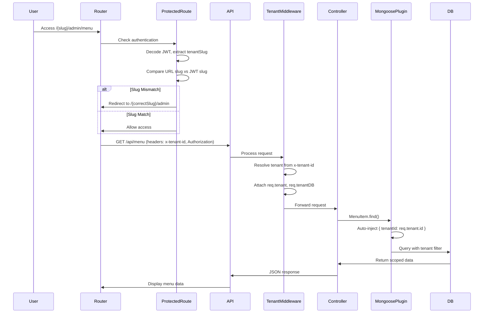

# Design Document: Tenant Data Isolation & Routing Context

## Overview

This design implements a comprehensive tenant data isolation system that transforms the current shared-dashboard architecture into a true multi-tenant system where each cafe owner experiences a standalone application. The solution addresses three critical layers:

1. **Frontend Routing Layer**: Migrates from global `/admin` routes to tenant-specific `/:tenantSlug/admin/*` routes
2. **Backend Data Layer**: Implements automatic tenant scoping for all database queries using Mongoose plugins
3. **Security Layer**: Enforces tenant validation at route access and ensures JWT-based tenant context propagation

The design follows the principle of "defense in depth" with multiple validation checkpoints and uses JWT tenantId as the authoritative source of truth for data access while maintaining URL slug for user-facing branding.

## Architecture

### High-Level Architecture

```mermaid
graph TB
    User[User Browser]
    Router[React Router]
    Auth[Auth Context]
    API[API Service]
    Middleware[Tenant Middleware Stack]
    Controller[Backend Controllers]
    Plugin[Mongoose Tenant Plugin]
    TenantDB[(Tenant Database)]
    
    User -->|Navigate to /{slug}/admin| Router
    Router -->|Check Auth| Auth
    Auth -->|Validate Slug Match| Router
    Router -->|API Request + x-tenant-id| API
    API -->|HTTP Request| Middleware
    Middleware -->|Extract Tenant Context| Controller
    Controller -->|Query with Auto-Filter| Plugin
    Plugin -->|Inject tenantId Filter| TenantDB
    TenantDB -->|Scoped Data| Controller
    Controller -->|Response| API
    API -->|Data| Router
    Router -->|Render| User

```

### Component Interaction Flow



### Architectural Principles

1. **Single Source of Truth**: JWT tenantId is authoritative for data access; URL slug is for UX only
2. **Fail-Safe Defaults**: All queries default to tenant-scoped; opt-out requires explicit override
3. **Defense in Depth**: Multiple validation layers (route guard, middleware, query plugin)
4. **Zero Trust**: Never trust URL parameters for security decisions; always validate against JWT
5. **Automatic Enforcement**: Use Mongoose plugins to eliminate manual filtering errors

## Components and Interfaces

### Frontend Components

#### 1. TenantRouter Component

**Purpose**: Wraps React Router to handle tenant-specific routing logic

**Location**: `frontend/src/components/TenantRouter.jsx`

**Interface**:
```typescript
interface TenantRouterProps {
  children: React.ReactNode;
}

interface TenantContext {
  tenantSlug: string;
  tenantId: string;
  validateSlugMatch: (urlSlug: string) => boolean;
  redirectToCorrectTenant: () => void;
}
```

**Responsibilities**:
- Extract tenant slug from JWT token
- Provide tenant context to child components
- Validate URL slug matches JWT slug
- Redirect to correct tenant route on mismatch

#### 2. Enhanced ProtectedRoute Component

**Purpose**: Extends existing ProtectedRoute with tenant validation

**Location**: `frontend/src/components/ProtectedRoute.jsx`

**Interface**:
```typescript
interface ProtectedRouteProps {
  children: React.ReactNode;
  allowedRoles: string[];
  requireTenant?: boolean; // Default: true for admin routes
}
```

**Responsibilities**:
- Check user authentication
- Validate user role permissions
- Verify URL slug matches JWT tenant slug
- Redirect to correct tenant route or login page

#### 3. Updated App.jsx Routing Structure

**Changes**:
```javascript
// OLD STRUCTURE
<Route path="/admin" element={<AdminLayout />}>
  <Route path="dashboard" element={<Dashboard />} />
  ...
</Route>

// NEW STRUCTURE
<Route path="/:tenantSlug/admin" element={
  <ProtectedRoute allowedRoles={['admin', 'kasir', 'staf']} requireTenant={true}>
    <AdminLayout />
  </ProtectedRoute>
}>
  <Route path="dashboard" element={<Dashboard />} />
  ...
</Route>

// Legacy redirect
<Route path="/admin/*" element={<LegacyAdminRedirect />} />
```

#### 4. SetupWizard Redirect Logic

**Purpose**: Redirect to tenant-specific dashboard after setup completion

**Location**: `frontend/src/pages/SetupWizard.jsx`

**Changes**:
```javascript
// After successful setup API call
const { tenant } = response.data;
navigate(`/${tenant.slug}/admin/dashboard`, { replace: true });
```

### Backend Components

#### 1. Mongoose Tenant Scoping Plugin

**Purpose**: Automatically inject tenantId filter into all queries

**Location**: `backend/plugins/tenantScopingPlugin.js`

**Interface**:
```javascript
function tenantScopingPlugin(schema, options) {
  // Add tenantId field to schema if not exists
  // Hook into pre-find, pre-findOne, pre-updateOne, etc.
  // Auto-inject tenantId filter from req.tenant.id
}
```

**Implementation Strategy**:
```javascript
// Apply to all tenant-scoped models
const tenantModels = [
  'MenuItem', 'Order', 'Employee', 'Inventory', 
  'Cash', 'Table', 'Customer', 'Recipe', 'Ingredient'
];

tenantModels.forEach(modelName => {
  const Model = require(`./models/${modelName}`);
  Model.schema.plugin(tenantScopingPlugin);
});
```

**Query Hooks**:
- `pre('find')`: Inject filter before find queries
- `pre('findOne')`: Inject filter before findOne queries
- `pre('updateOne')`: Inject filter before updates
- `pre('updateMany')`: Inject filter before bulk updates
- `pre('deleteOne')`: Inject filter before deletes
- `pre('deleteMany')`: Inject filter before bulk deletes
- `pre('save')`: Auto-set tenantId on document creation

#### 2. Enhanced TenantResolver Middleware

**Purpose**: Extract and validate tenant context from request headers

**Location**: `backend/middleware/tenantResolver.js`

**Current Implementation**: Already exists and functional

**Enhancement Needed**:
```javascript
// Add tenant context to request for plugin access
req.tenant = {
  id: tenant._id,
  slug: tenant.slug,
  dbName: tenant.dbName
};
req.tenantDB = tenantDB;

// Make tenant context available globally for Mongoose plugin
// Store in AsyncLocalStorage or similar
```

#### 3. Tenant Context Storage

**Purpose**: Provide global access to tenant context for Mongoose plugins

**Location**: `backend/utils/tenantContext.js`

**Interface**:
```javascript
const { AsyncLocalStorage } = require('async_hooks');
const tenantContext = new AsyncLocalStorage();

function setTenantContext(tenant) {
  tenantContext.enterWith(tenant);
}

function getTenantContext() {
  return tenantContext.getStore();
}

module.exports = { setTenantContext, getTenantContext };
```

**Integration with Middleware**:
```javascript
// In tenantResolver.js
const { setTenantContext } = require('../utils/tenantContext');

// After resolving tenant
setTenantContext({
  id: tenant._id,
  slug: tenant.slug,
  dbName: tenant.dbName
});
```

#### 4. Enhanced API Service

**Purpose**: Automatically include tenant slug in request headers

**Location**: `frontend/src/services/api.js`

**Enhancement**:
```javascript
// Add request interceptor
api.interceptors.request.use((config) => {
  const token = localStorage.getItem('token');
  if (token) {
    const decoded = jwtDecode(token);
    if (decoded.tenant) {
      config.headers['x-tenant-id'] = decoded.tenant;
    }
  }
  return config;
});
```

#### 5. File Upload Service Enhancement

**Purpose**: Namespace uploaded files by tenantId

**Location**: `backend/controllers/ImageController.js`

**Changes**:
```javascript
// OLD: uploads/{filename}
// NEW: uploads/{tenantId}/{filename}

const uploadPath = path.join('uploads', req.tenant.id, filename);
```

### Database Schema Updates

#### Tenant Model Enhancement

**Location**: `backend/models/Tenant.js`

**Add Unique Index**:
```javascript
TenantSchema.index({ slug: 1 }, { 
  unique: true, 
  collation: { locale: 'en', strength: 2 } // Case-insensitive
});
```

#### Tenant-Scoped Models

**Add tenantId Field** (if not already present):
```javascript
const schema = new mongoose.Schema({
  tenantId: {
    type: mongoose.Schema.Types.ObjectId,
    ref: 'Tenant',
    required: true,
    index: true
  },
  // ... other fields
});

// Apply tenant scoping plugin
schema.plugin(tenantScopingPlugin);
```

**Models Requiring tenantId**:
- MenuItem
- Order
- Employee
- Inventory (Ingredient)
- Cash
- CashTransaction
- Table
- Customer
- Recipe
- Category
- Expense
- Debt
- Attendance
- Shift
- Payroll
- Reservation
- ServiceRequest
- Feedback
- MarketingCampaign

## Data Models

### JWT Token Payload

```typescript
interface JWTPayload {
  id: string;              // Employee ID in tenant DB
  email: string;
  role: string;
  tenant: string;          // Tenant slug (for x-tenant-id header)
  tenantDbName: string;    // Database name
  userId: string;          // User ID in main DB
  iat: number;
  exp: number;
}
```

### Tenant Context Object

```typescript
interface TenantContext {
  id: ObjectId;            // Tenant ID (source of truth for queries)
  slug: string;            // Tenant slug (for UI/routing)
  name: string;            // Tenant display name
  dbName: string;          // Database name
}
```

### Request Object Extensions

```typescript
interface AuthenticatedRequest extends Request {
  user: JWTPayload;        // From JWT middleware
  tenant: TenantContext;   // From tenantResolver middleware
  tenantDB: Connection;    // Mongoose connection to tenant DB
}
```


## Correctness Properties

*A property is a characteristic or behavior that should hold true across all valid executions of a system—essentially, a formal statement about what the system should do. Properties serve as the bridge between human-readable specifications and machine-verifiable correctness guarantees.*

### Property Reflection

After analyzing all acceptance criteria, I identified the following redundancies:

- **1.4 and 6.1**: Both test legacy `/admin` route redirect - can be combined
- **4.5 and 5.4**: Both test redirect to Setup Wizard for users without tenant - duplicate
- **5.6**: Architectural principle already covered by 2.1 - not a separate property
- **3.5**: General design goal covered by other properties - not testable separately
- **6.3**: Integration concern, not a unit property
- **6.4**: Already covered by 1.4/5.2 redirect logic
- **7.5**: UX quality goal, subjective and not automatically testable

The following properties provide unique validation value and will be implemented:

### Frontend Routing Properties

**Property 1: Dashboard Navigation Preserves Tenant Slug**
*For any* sequence of navigation actions within the dashboard, the tenantSlug parameter should remain present and unchanged in all resulting URLs
**Validates: Requirements 1.2**

**Property 2: Legacy Admin Route Redirects to Tenant Route**
*For any* authenticated user with a tenant, accessing the legacy `/admin` route should redirect to `/{tenantSlug}/admin` where tenantSlug is extracted from their JWT token
**Validates: Requirements 1.4, 6.1**

**Property 3: Slug Case-Insensitive Uniqueness**
*For any* two tenant slugs that differ only in letter casing, the system should reject the creation of the second tenant with a uniqueness constraint error
**Validates: Requirements 1.6**

**Property 4: URL Slug Mismatch Triggers Redirect**
*For any* authenticated user attempting to access `/{wrongSlug}/admin/*` where wrongSlug does not match their JWT tenantSlug, the system should redirect to `/{correctSlug}/admin/*` using the slug from their JWT
**Validates: Requirements 5.1, 5.2**

**Property 5: Unauthenticated Access Redirects to Login**
*For any* attempt to access tenant-specific admin routes without a valid JWT token, the system should redirect to the login page
**Validates: Requirements 5.3**

**Property 6: Incomplete Setup Redirects to Wizard**
*For any* user without hasCompletedSetup flag attempting to access tenant-specific routes, the system should redirect to the Setup Wizard
**Validates: Requirements 4.5, 5.4**

**Property 7: Invalid Slug Format Rejected**
*For any* tenant slug that does not match the valid format (lowercase alphanumeric with hyphens), the system should reject access and display an error message
**Validates: Requirements 5.5**

**Property 8: State Preservation During Legacy Redirect**
*For any* application state present when accessing a legacy route, that state should be preserved after redirect to the tenant-specific route
**Validates: Requirements 6.2**

### Backend Data Isolation Properties

**Property 9: JWT TenantId Used for Queries**
*For any* database query in a backend controller, the tenantId filter should be derived from req.user (JWT) and not from URL parameters
**Validates: Requirements 2.1**

**Property 10: Automatic TenantId Filter Injection**
*For any* query executed on a tenant-scoped Mongoose model, the query filter should automatically include the tenantId from the request context
**Validates: Requirements 2.2**

**Property 11: Cross-Tenant Data Isolation**
*For any* two tenants A and B, a query made by tenant A should never return data records belonging to tenant B
**Validates: Requirements 2.3**

**Property 12: New Records Auto-Tagged with TenantId**
*For any* new record created through a backend controller, the record should automatically have its tenantId field set to the requesting tenant's ID
**Validates: Requirements 2.4**

**Property 13: Cross-Tenant Modification Prevention**
*For any* update or delete operation, if the target record's tenantId does not match the requesting tenant's ID, the operation should fail with an authorization error
**Validates: Requirements 2.5**

**Property 14: File Upload Path Namespacing**
*For any* file uploaded through the system, the storage path should include the tenantId as a namespace component (e.g., `uploads/{tenantId}/{filename}`)
**Validates: Requirements 2.7**

### Tenant Context Propagation Properties

**Property 15: JWT Contains Tenant Information**
*For any* successful login or setup completion, the generated JWT token should contain both tenantSlug and tenantId fields in its payload
**Validates: Requirements 3.1**

**Property 16: API Requests Include Tenant Header**
*For any* authenticated API request from the frontend, the request headers should include `x-tenant-id` with the value from the JWT token
**Validates: Requirements 3.2**

**Property 17: Middleware Attaches Tenant Context**
*For any* request processed by the tenantResolver middleware, the request object should have both req.tenant (metadata) and req.tenantDB (connection) populated
**Validates: Requirements 3.3, 3.4**

### Error Handling Properties

**Property 18: Invalid Slug Shows User-Friendly Error**
*For any* tenant slug that is invalid or not found in the database, the system should display a user-friendly error message (not a stack trace or technical error)
**Validates: Requirements 7.1**

**Property 19: Tenant Resolution Failure Logs Details**
*For any* failure in tenant context resolution, the system should log detailed error information including tenantId, error message, and stack trace to the server logs
**Validates: Requirements 7.3**

**Property 20: Tenant Scoping Errors Return Generic User Message**
*For any* database query failure due to tenant scoping issues, the HTTP response should contain a generic 500 error message while detailed error information is logged server-side
**Validates: Requirements 7.4**

### Integration Properties

**Property 21: Setup Completion Redirects to Tenant Dashboard**
*For any* successful setup wizard completion, the frontend should navigate to `/{tenantSlug}/admin/dashboard` where tenantSlug is extracted from the API response
**Validates: Requirements 1.3, 4.1, 4.2, 4.3**

**Property 22: Legacy Route Access Logged**
*For any* access to a legacy `/admin` route, the system should create a log entry for monitoring purposes
**Validates: Requirements 6.5**

## Error Handling

### Frontend Error Scenarios

1. **Slug Mismatch Detection**
   - **Trigger**: User accesses `/{wrongSlug}/admin` where wrongSlug !== JWT tenantSlug
   - **Handling**: Silent redirect to `/{correctSlug}/admin` with toast notification
   - **User Experience**: "Redirecting to your dashboard..."

2. **Invalid Slug Format**
   - **Trigger**: User accesses `/{invalid-slug}/admin` where slug contains invalid characters
   - **Handling**: Show error page with message "Invalid cafe URL"
   - **User Experience**: Provide link to login or setup wizard

3. **Tenant Not Found**
   - **Trigger**: User accesses `/{nonexistent-slug}/admin`
   - **Handling**: Show 404 error page
   - **User Experience**: "Cafe not found. Please check the URL."

4. **Missing Authentication**
   - **Trigger**: Unauthenticated user accesses tenant admin routes
   - **Handling**: Redirect to `/auth/login` with return URL
   - **User Experience**: Standard login flow

5. **Incomplete Setup**
   - **Trigger**: User with hasCompletedSetup=false accesses admin routes
   - **Handling**: Redirect to `/setup-cafe`
   - **User Experience**: "Please complete your cafe setup first"

### Backend Error Scenarios

1. **Missing x-tenant-id Header**
   - **HTTP Status**: 400 Bad Request
   - **Response**: `{ success: false, message: "Header x-tenant-id wajib disertakan" }`
   - **Logging**: Warn level with request details

2. **Tenant Not Found or Inactive**
   - **HTTP Status**: 404 Not Found
   - **Response**: `{ success: false, message: "Tenant tidak ditemukan atau tidak aktif" }`
   - **Logging**: Warn level with tenantId

3. **Tenant Resolution Failure**
   - **HTTP Status**: 500 Internal Server Error
   - **Response**: `{ success: false, message: "Terjadi kesalahan saat memproses tenant" }`
   - **Logging**: Error level with full stack trace

4. **Cross-Tenant Access Attempt**
   - **HTTP Status**: 403 Forbidden
   - **Response**: `{ success: false, message: "Unauthorized access to tenant data" }`
   - **Logging**: Security warn with attempted access details

5. **Database Query Failure**
   - **HTTP Status**: 500 Internal Server Error
   - **Response**: `{ success: false, message: "Terjadi kesalahan saat mengambil data" }`
   - **Logging**: Error level with query details and tenant context

### Error Recovery Strategies

1. **Automatic Retry**: For transient tenant resolution failures (DB connection issues)
2. **Graceful Degradation**: Show cached data if tenant DB is temporarily unavailable
3. **User Guidance**: Provide clear next steps in error messages (e.g., "Try logging in again")
4. **Admin Notification**: Alert system admins for repeated tenant resolution failures
5. **Audit Trail**: Log all security-related errors (cross-tenant access attempts) for review

## Testing Strategy

### Dual Testing Approach

This feature requires both unit tests and property-based tests to ensure comprehensive coverage:

- **Unit Tests**: Validate specific examples, edge cases, and error conditions
- **Property Tests**: Verify universal properties across all inputs using randomized testing

Together, these approaches provide defense-in-depth: unit tests catch concrete bugs in specific scenarios, while property tests verify general correctness across the input space.

### Property-Based Testing Configuration

**Library Selection**: 
- Frontend: `fast-check` (JavaScript/TypeScript property-based testing)
- Backend: `fast-check` (Node.js compatible)

**Test Configuration**:
- Minimum 100 iterations per property test
- Each test tagged with: `Feature: tenant-data-isolation, Property {N}: {property_text}`
- Seed-based reproducibility for failed test cases

**Property Test Categories**:

1. **Routing Properties** (Properties 1-8)
   - Generate random navigation sequences
   - Generate random slug formats (valid/invalid)
   - Generate random JWT payloads with tenant info
   - Test with various authentication states

2. **Data Isolation Properties** (Properties 9-14)
   - Generate multiple tenants with overlapping data
   - Generate random CRUD operations
   - Generate random file uploads
   - Verify no cross-tenant data leakage

3. **Context Propagation Properties** (Properties 15-17)
   - Generate random login/setup scenarios
   - Generate random API request patterns
   - Verify tenant context availability

4. **Error Handling Properties** (Properties 18-20)
   - Generate invalid slugs
   - Generate tenant resolution failures
   - Verify error message formats

### Unit Testing Focus Areas

1. **Specific Examples**:
   - Setup wizard redirect to `/{slug}/admin/dashboard`
   - Legacy `/admin` redirect for authenticated user
   - Cross-tenant access attempt returns 403

2. **Edge Cases**:
   - Empty tenant slug
   - Slug with special characters
   - Very long slug (>100 characters)
   - Tenant with no data
   - Concurrent requests from same tenant

3. **Integration Points**:
   - JWT middleware → TenantResolver middleware → Controller flow
   - Frontend route guard → API call → Backend validation
   - File upload → Storage path generation → Retrieval

4. **Error Conditions**:
   - Database connection failure during tenant resolution
   - Invalid JWT token format
   - Expired JWT token
   - Tenant marked as inactive

### Test Coverage Goals

- **Frontend Routing**: 90%+ coverage of routing logic and guards
- **Backend Controllers**: 100% coverage of tenant scoping logic
- **Mongoose Plugin**: 100% coverage of query hook injection
- **Middleware**: 95%+ coverage of tenant resolution paths
- **Error Handling**: 100% coverage of all error scenarios

### Manual Testing Checklist

1. Create two tenants (A and B) with different slugs
2. Add menu data to tenant A
3. Login as tenant B
4. Verify tenant B sees no data from tenant A
5. Attempt to access tenant A's URL while logged in as tenant B
6. Verify automatic redirect to tenant B's correct URL
7. Test legacy `/admin` route redirect
8. Test setup wizard completion redirect
9. Upload files as both tenants and verify path isolation
10. Test all error scenarios with invalid slugs

